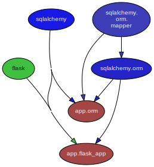

# SA Lab1  Dependency Analysis and Dependency Graphs
> 201931990124 刘长优
>
> 201931990122 黄凯峰
>
> 201931990130 王晨航
>
> 201931990127 骆纪元
>
> [Read the Lab1](https://englishpal-78.readthedocs.io/en/latest/SA-lab1.html)

## Abstract
分析三个项目各自的内部依赖，利用工具绘制模块、类/函数依赖关系图，通过比较，加深对软件体系结构的理解。
## Introduction
EnglishPal是一款面向希望提升自身英语阅读能力的用户，提供英语文章学习服务的轻量级在线网站。

它内设了多达百篇不同难度等级的文章，会根据用户的英语水平为用户提供相应难度的文章进行练习；同时，每一个用户还享有独立的生词本，用户可以将在阅读文章过程中遇到的生词收集起来，在复习中进行针对性记忆。

本次实验通过分析项目在模块、类两个层次上的依赖关系，使用工具对依赖关系图形化，理解不同软件架构的优缺点。
## Materials and Methods
- [pydeps-Python module dependency visualization](https://pypi.org/project/pydeps/): 可视化项目模块间依赖关系
- Graphviz: 图形化.dot文件
- Mermaid: 生成类/函数关系图
## Results
### BeginningOfSpring
- 模块
```
digraph G {
    concentrate = true;

    rankdir = TB;
    node [style=filled,fillcolor="#ffffff",fontcolor="#000000",fontname=Helvetica,fontsize=10];

    Yaml [fillcolor="#c24747",fontcolor="#ffffff"];
    app_Article [fillcolor="#80b34c",label="app.Article"];
    app_Yaml [fillcolor="#80b34c",label="app.Yaml"];
    app_account_service [fillcolor="#80b34c",label="app\.\naccount_service"];
    app_main [fillcolor="#80b34c",label="app.main"];
    app_user_service [fillcolor="#7aac49",label="app\.\nuser_service"];
    flask [fillcolor="#26d9d9"];
    yaml [fillcolor="#8553b6",fontcolor="#ffffff"];
    Yaml -> app_main [fillcolor="#c24747",minlen="2"];
    Yaml -> app_user_service [fillcolor="#c24747",minlen="2"];
    flask -> app_Article [fillcolor="#26d9d9",minlen="2"];
    flask -> app_account_service [fillcolor="#26d9d9",minlen="2"];
    flask -> app_user_service [fillcolor="#26d9d9",minlen="2"];
    yaml -> app_Yaml [fillcolor="#8553b6",minlen="2"];
}
```

- 类/函数
```
graph TD
    check_username_availability-->signup
    add_user-->signup
    get_expiry_date-->signup
    verify_user-->signup
    get_expiry_date-->login
    verify_user-->login
    

    logout
    change_password-->reset
    total_number_of_essays
    get_article_title
    get_article_body

    load_freq_history-->get_today_article
    get_difficulty_level-->get_today_article
    user_difficulty_level-->get_today_article
    text_difficulty_level-->get_today_article
    get_article_title-->get_today_article
    get_article_body-->get_today_article
    get_question_part-->get_today_article
    get_answer_part-->get_today_article

    load_record-->load_freq_history
    within_range
    get_question_part
    get_answer_part
    load_record
    difficulty_level_from_frequency
    difficulty_level_from_frequency-->get_difficulty_level
    revert_dict-->user_difficulty_level
    sort_in_ascending_order-->user_difficulty_level
    remove_punctuation-->text_difficulty_level
    freq-->text_difficulty_level

    md5-->verify_user
    instructions_with_parameters-->verify_user
    md5-->add_user
    check_username_availability
    verify_user-->change_password
    md5-->change_password
    get_expiry_date
    md5

    get_random_image
    get_random_ads
    appears_in_test
    load_freq_history-->mark_word
    dict2lst-->mark_word
    merge_frequency-->mark_word
    save_frequency_to_pickle-->mark_word
    get_freq-->mainpage
    load_freq_history-->mainpage
    dict2lst-->mainpage
    merge_frequency-->mainpage
    save_frequency_to_pickle-->mainpage
    get_random_ads-->mainpage
    total_number_of_essays-->mainpage
    load_freq_history-->mainpage
    sort_in_descending_order-->mainpage
    
    lst2dict
    dict2lst
    lst2dict-->merge_frequency
    load_record
    save_frequency_to_pickle
    unfamiliar
    familiar

    lst2dict
    deleteRecord
    dict2lst
    lst2dict-->merge_frequency
    load_record
    save_frequency_to_pickle

    user_reset
    unfamiliar-->unfamiliar
    familiar-->familiar
    deleteRecord-->deleteword
    get_freq-->userpage
    load_freq_history-->userpage
    dict2lst-->userpage
    sort_in_descending_order-->userpage
    get_today_article-->userpage
    load_freq_history-->user_mark_word
    dict2lst-->user_mark_word
    merge_frequency-->user_mark_word
    save_frequency_to_pickle-->user_mark_word
    get_time
    get_flashed_messages-->get_flashed_messages_if_any

    freq
    youdao_link
    file2str
    remove_punctuation
    sort_in_descending_order
    sort_in_ascending_order
    make_html_page
```

### ColdDew
- 模块
```
digraph G {
    concentrate = true;

    rankdir = TB;
    node [style=filled,fillcolor="#ffffff",fontcolor="#000000",fontname=Helvetica,fontsize=10];

    app_main [fillcolor="#b34c4c",fontcolor="#ffffff",label="app.main"];
    flask [fillcolor="#40bfc0"];
    flask -> app_main [fillcolor="#40bfc0",minlen="2"];
}
```

- 类/函数
```
classDiagram
    UseSqlite <|-- main
    WordFreq<|-- main
    difficulty<|-- main
    wordfreqCMD <|-- WordFreq
    wordfreqCMD <|-- difficulty
    class UseSqlite{
      + query
      +instructions(query)
    }
    class difficulty{
       + pickle_fname
       + word
       + s
       + d
       + d1
       + d2
       + d3
       + d_user
      +load_record(pickle_fname)
      +difficulty_level_from_frequency(word,d)
      +get_difficulty_level(d1,d2)
      +revertdict(d)
      +user_difficulty_level(d_user, d)
      +text_difficulty_level(s, d)

    }
    class WordFreq{
      +s
      +get_freq()
    }
    class wordfreqCMD{
       +fruit
       +s
       +fname
       +lst
       +freq(fruit)
       +youdao_link(s)
       +file2str(fname)
       +remove_punctuation(s)
      + sort_in_descending_order(lst)
     +  sort_in_ascending_order(lst)
      + make_html_page(lst, fname)
    }
    class pickle_idea{
        +lst
        +d
        +lst1
        +lst2
        +pickle_fname
        +path
        +word
        +lst2dict(lst, d)
        +dict2lst(d)
        +merge_frequency(lst1, lst2)
        +load_record(pickle_fname)
        +save_frequency_to_pickle(d, pickle_fname)
        +unfamiliar(path,word)
        +familiar(path,word)
    }
    class pickle_idea2{
        +lst
        +d
        +lst1
        +lst2
        +pickle_fname
        +path
        +word
        +lst2dict(lst, d)
        +deleteRecord(path,word)
        +dict2lst(d)
        +merge_frequency(lst1, lst2)
        +load_record(pickle_fname)
        +save_frequency_to_pickle(d, pickle_fname)
    }
    class main{
        +path
        +username
        +password
        +x
        +y
        +r
        +s
        +user_word_list
        +articleID
        +word
        +d
        +_init_()
        +get_random_image(path)
        +get_random_ads()
        +total_number_of_essays()
        +load_freq_history(path)
        +verify_user(username, password)
        +add_user(username, password)
        +check_username_availability(username)
        +get_expiry_date(username)
        +within_range(x, y, r)
        +get_article_title(s)
        +get_today_article(user_word_list, articleID)
        +appears_in_test(word, d)
        +get_time()
        +get_question_part(s)
        +get_answer_part(s)
    }
```

### Chap4
- 模块
```
digraph G {
    concentrate = true;

    rankdir = TB;
    node [style=filled,fillcolor="#ffffff",fontcolor="#000000",fontname=Helvetica,fontsize=10];

    app_flask_app [fillcolor="#a44646",fontcolor="#ffffff",label="app.flask_app"];
    app_orm [fillcolor="#a44646",fontcolor="#ffffff",label="app.orm"];
    flask [fillcolor="#40c040"];
    sqlalchemy [fillcolor="#1919e6",fontcolor="#ffffff"];
    sqlalchemy_orm [fillcolor="#2323c8",fontcolor="#ffffff",label="sqlalchemy.orm"];
    sqlalchemy_orm_mapper [fillcolor="#3d3db8",fontcolor="#ffffff",label="sqlalchemy\.\norm\.\nmapper"];
    flask -> app_flask_app [fillcolor="#40c040",minlen="2"];
    sqlalchemy -> app_flask_app [fillcolor="#1919e6",minlen="2"];
    sqlalchemy -> app_orm [fillcolor="#1919e6",minlen="2"];
    sqlalchemy_orm -> app_flask_app [fillcolor="#2323c8",minlen="2"];
    sqlalchemy_orm -> app_orm [fillcolor="#2323c8"];
    sqlalchemy_orm_mapper -> app_orm [fillcolor="#3d3db8",minlen="2"];
    sqlalchemy_orm_mapper -> sqlalchemy_orm [fillcolor="#3d3db8",weight="2"];
}
```

- 类/函数
```
classDiagram
    AbstractRepository <|-- SqlAlchemyRepository
    OrderLine <.. OutOfStock
    Batch <.. OutOfStock
    OrderLine <.. Batch
    OrderLine <.. MetaData
    Batch <.. MetaData
    Batch <.. AbstractRepository
    OrderLine <.. InvalidSku
    Batch <.. InvalidSku
    OrderLine <.. Flask
    OutOfStock <.. Flask
    InvalidSku <.. Flask
    SqlAlchemyRepository <.. Flask
    MetaData <.. Flask

    class AbstractRepository{
      +session
      +batch
      +reference
      +add()
      +get()
    }
    class SqlAlchemyRepository{
      +session
      +batch
      +reference
      _init_()
      +add()
      +get()
      +list()
    }
    class OutOfStock{
      +pass
      +allocate()
    }
    class OrderLine{
      +Str orderid
      +Str sku
      +int qty
    }
    class Batch{
      +Str ref
      +Str sku
      +int qty
      _init_()
      +repr()
      +eq()
      +hash()
      +gt()
      +allocate()
      +deallocate()
      +allocated_quantity()
      +available_quantity()
      +can_allocate()
    }
    class MetaData{
      +order_lines
      +batches
      +allocations
      +start_mappers()
    }
    class InvalidSku{
      +is_valid_sku()
      +allocate()
    }
     class Flask{
      +session
      +repo
      +line
      +allocate_endpoint()
    }
```

### Comparing BeginningOfSpring with ColdDew

|                                                              | ColdDew | BeginningOfSpring |
| ------------------------------------------------------------ | ------- | ----------------- |
| Lines of code in main.py (excluding blank lines and comments) | 499     | 115               |
| Number of HTML files in folder templates                     | 2       | 9                 |
| Has a service layer? Answer Yes or No.                       | No      | Yes               |
| Front-end and back-end coupling. Answer Strong or Weak.      | Strong  | Weak              |
| Number of module-level dependencies                          | 1       | 6                 |

## Discussions

> - From a scale 1 (worst) to scale 5 (best), how would you evaluate the architectural health of each version of EnglishPal? Which version of EnglishPal is easier to understand and maintain? Explainin no more than 3 sentences.
> - Pros and cons of the current architecture of EnglishPal, BeginningOfSpring.

### 1.架构健壮性评估

- ColdDew: 1
- BeginningOfSpring: 4

### 2.BeginningOfSpring可维护性和可读性高

- ColdDew的main.py太臃肿了，难以阅读和理解
- ColdDew后端代码和前端HTML混合在一起，不利于维护

### 3.BeginningOfSpring的架构的优缺点

#### 优点

- 前后端分离，项目具有良好的可读性和可维护性
- 项目有一个基本的层次结构，便于扩展

#### 缺点

- 虽然分离了前后端，但是后端代码中依然存在HTML
- 项目注释不够完善，模块的定义模糊

